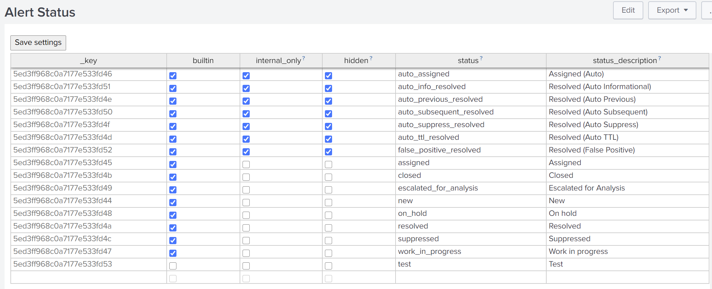
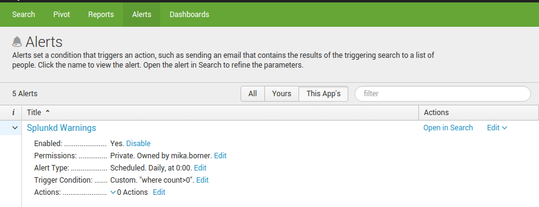
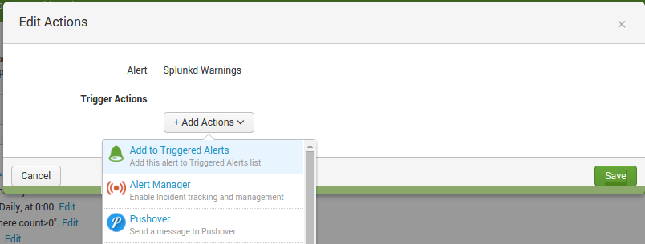
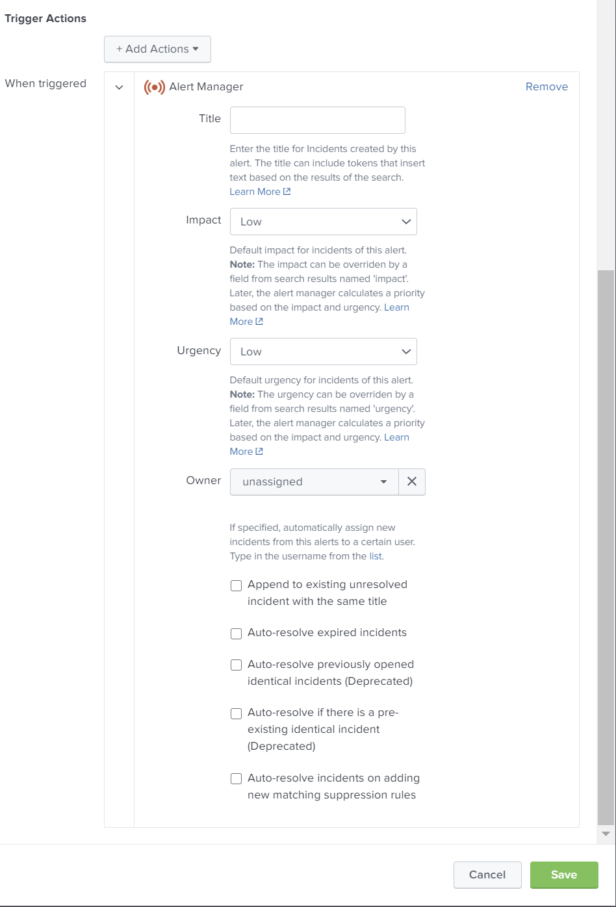
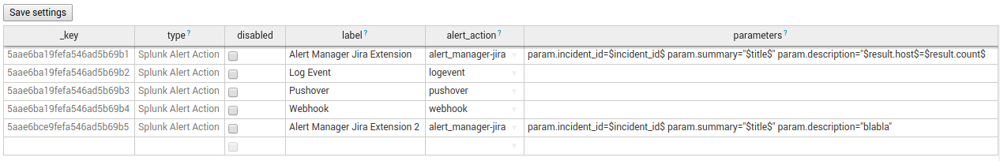

# Configuration

## Configure Users

Users in the Alert Manager are supposed to be virtual. In addition to users in Splunk's ecosystem, e.g. Splunk internal users or users from an external LDAP repository, virtual Alert Managers users allow Incident assignment to external parties without creating them as a real Splunk user.

**Note:** There is **no** additional functionality than assigning Incidents to such users. They can't login to Splunk.

Add a Virtual Alert Manager user:

* Open Settings -> User Settings in the Alert Manager
* Ensure the active user directory is set to **both**
* Fill in a username and his e-mail address (can be used as current_owner variable in Notification Schemes) and press *Save Users*
* Go back to the Incident Posture view and assign an Incident to the new user

### Disable Alert Manager Users

To disable virtual Alert Manager users, just set the  active user directory to 'builtin' and press 'Save'. Users already existing won't get removed so Incidents assigned to them aren't broken but you cannot assign Incidents to them anymore from that point.

## Configure Alert Status

Alert Manager allows  Alert Status customization. To change which statuses are available, follow the steps:

* Open the Alert Status Settings under Alert Manager -> Settings -> Alert Status
* A table shows all available statuses

 

* The `builtin` column show all statuses that are deliverd by default with Alert Manager
* The `internal_only` column shows statuses that are internal to Alert Manager
* The `status` column stores the name of the status and the `status_description` column contains a user-friendly name for the status
* Statuses can be added, changed and removed

**Important:** Be careful when deleting builtin/internal_only statuses

## Configure E-Mail Notifications

### Understand how E-Mail Notifications work

E-Mail notifications in the Alert Manager are based on different components:

* **Notification Schemes**: Link **Notifications** to events
* **Notifications**: Are part of the **Notification Scheme**, are defined by a **sender address**, a list of **recipient addresses and types**, a template used for the **Notification**
* **Events**: Certain point in the incident workflow where **Notifications** can be attached to
* **E-Mail Templates**: Link a **E-Mail Template File** to a **E-Mail Template** and define the **subject** of the **Notification**
* **E-Mail Template Files**: Define the **Message Body** of the **Notification**

In other words, the central nerve-system of the Notification system in the Alert Manager are the **Notification Schemes**. A scheme can be assigned to an alert in the Incident Settings view (Navigation: **Settings** -> **Incident Settings**) and also can be reused for as many alerts as wanted.

Each **Notification Scheme** can contain one or many **Notifications**, even for the same **Event**. This allows to send multiple dedicated **E-Mail Notifications** to a different list of recipients using different templates.

**Example:**

* The Alert creates Incidents upon failed authentication attempts to Splunk
* Send a whitelabeled, HTML-formatted **E-Mail Notification** to the user with the failed login attempt to warn him
* Send a plaintext **E-Mail Notification** to a mailbox monitored by an external incident management tool for further processing

### Active Events

In this release, the Alert Manager supports a number of **Events** where **Notifications** can be configured.

Event Name |  Description | Notes
-----------|--------------|-------
incident_created | New incident has been created |
incident_suppressed | New incident has been created and was automatically suppressed | The event 'incident_created' does not get fired in this case
incident_auto_assigned | Incident has been created and automatically assigned to a specific owner |
incident_assigned | Incident has been reassigned manually | The event 'incident_changed' does not get fired in this case
incident_changed | An attribute (Status, Urgency, Comment) of an Incident has been changed |
incident_resolved | The status of an incident has been changed manually to 'Resolved' | The event 'incident_changed' does not get fired in this case
incident_auto_previous_resolved | An incident has been resolved due a new incident with the same title |
incident_auto_ttl_resolved | An incident has been resolved by the Alert Manager scheduler after the TTL has been reached |
incident_auto_suppress_resolved | An incident has been resolved by the Alert Manager scheduler after a matching Suppression Rule was added |

## Configure Alerts

The the Alert Manager App's main purpose is to extend Splunk's core alerting functionality with sophisticated incident workflows and reporting.
He can be also used to replace existing workflow solutions (eg. Incident Review in Enterprise Security).

### Alert Manager core concepts

The Alert Manager is built on top of Splunk's core alerting functionality, utilizing its main functionality. Instead of just doing a "fire and forget" action on the alert, the Alert Manager will store the state of an alert as an incident in a KV store.
The app was designed to easily integrate into existing environments by just enabling the Customer Alert Action shipped with the app to your alerts that should be managed and adding the alert_manager role to the users that use the app or send alerts to the app. Pre-existing Alert Scripts still be used by configuring it with another alert action.

#### Alerts & Incidents

It is important, to distinguish between the terms alerts and incidents.

* The term *Alert* is used for alerts triggered by a Splunk scheduled search. Alert metadata is indexed by default into an index named `alerts` (if not changed during setup).

* The term *Incident* is used for enriched metadata around the alert. The data is stored in a KV store and some metadata is enriched using lookup tables (for dynamic customizations).

Incidents are stored with metadata such as `alert_time`, `job_id`, `owner`, `status`, `priority`, `ttl`, etc.

#### Incident Settings

Incident settings are used to define, which Splunk alerts should create incidents within the Alert Manager.

#### Incident Categorization

Categorization is used to group incidents. Categorization can be used to filter incidents on the Incident Posture dashboard and run category statistics. There are two attributes can be used: category and subcategory.

#### Incident Tags

For more complex environments, incidents can be tagged with an arbitrary number of tags. Incidents can be filtered on the Incident Posture.

#### Impact, Priority and Urgency

The incident's urgency is calculated using the alert's severity and the incident's default priority setting. This is based on a lookup table. The default settings are according to this matrix:

Impact | Urgency | Priority
------ | ------- | --------
low    | low     | informational
low    | medium  | low
low    | high    | medium
medium | low     | low
medium | medium  | medium
medium | high    | high
high   | low     | medium
high   | medium  | high
high   | high    | critical

#### Auto Assignment

Alert Manager allows incidents to be automatically assigned to owners.

#### Auto Resolve

Splunk's alerting facility triggers on search results. Sometimes an incident is resolved if no further search-results are found. In this case the "Auto-resolve expired incidents" -function can be used.

Another scenario could be, that an alert keeps recurring many times before an incident owner can find the root cause and fix the problem. This may cause a lot of incidents in the "new"-state. To close these previously opened incidents, the Auto Previous Resolve -function can be used.

#### Auto-resolve expired incidents

To use the "Auto-resolve expired incidents" feature, the expiration time of the triggered alert time should be set. E.g. if an alert search runs every 15 Minutes, the expiration time should also be set to 15 Minutes.

E.g. the first alert fires at 1:00am and creates an incident. The next scheduled alert runs at 1:15am without results. The first alert from 1:00am will expire at 1:15am and the incident will be automatically resolved with status auto_ttl_resolve.

#### Auto-resolve previously opened identical incidents

The Auto Previous Resolve feature closes previous incident in status "new".

E.g. the first alert fires at 1:00am and creates an incident. The next scheduled alert fires at 1:15am and opens a new incident. If the first incident from 1:00am is still in status "new", it will be automatically resolved with status auto_previous_resolve. In case, the first incident's status was changed, it will not be resolved and it's status will be preserved.

#### Auto-resolve newly incidents opened identical incidents

#### Auto-resolve incidents on adding new matching suppression rules

Alert Manager supports the suppression of incidents e.g. during maintenance windows or for false positives. Incidents, that are suppressed will be automatically closed.

### Configure the Custom Alert Action

For alerts to be managed by the Alert Manager a few per-requisites have to be fulfilled.

The scheduled alert has be configured to run additional actions. This is done under the Alerts Settings dashboard.

Select the edit button. An **Edit Action** pop-up window opens.

Select the **Alert Manager** action. A form will be added into the pop-up window.

**Note:** To customize the title of an incident, you can include field values from results using `$result.fieldname$` syntax.

### Configure Incident Settings

A few incident settings have to be configured separately from the alert actions.

By default, the table shows all alerts that are managed by the Alert Manager (indicated by the `_key` column). Depending on the App context drop-down selection, alerts that are readable by the logged in user's role, are displayed. Unmanaged alerts do not yet have a `_key` set.

To configure an unmanaged alert to be managed, the App context where the alert resides in needs to be selected. All alerts in the app context will be displayed in the table. If there are alerts that, are superfluous, they can be deleted by right-clicking on the table and selecting _Remove row_.

To store the new incident configuration, _Save settings_ has to be selected. Before or after saving, further customization of the incident can be applied.

#### Alert

The name of the Alert (Saved Search). Read-only field.

#### Category and Subcategory

A category and a subcategory can be defined for every incident.

#### Tags

Tags have to be entered as a space separated list. If no tags are entered, the field will show the value of `[untagged]`.

#### Display Fields

An optional space separated list of fields to be displayed under the incident details.

#### Notification Scheme

The selected notification scheme for this Incident

### Configure Impact, Priority and Urgency

The incident's urgency is calculated based on a lookup table named `alert_urgencies`. A lookup table has been provided under `$APP_HOME/lookup/alert_urgencies.csv.sample`.

To adjust the urgencies, create a new lookup table `$APP_HOME/lookup/alert_urgencies.csv` and edit `$APP_HOME/local/transforms.conf` to point to this new lookup table.

If auto_previous_resolve is selected, previously opened incident with the same alert name, and status new will be automatically resolved.

### Link Notification Schemes to Alerts

### Create E-Mail Template Files

**E-Mail Template Files** are located at two paths:

* Default templates shipped with the Alert Manager at `$SPLUNK_HOMEe/etc/apps/alert_manager/default/templates`
* User created templates at  `$SPLUNK_HOMEe/etc/apps/alert_manager/local/templates`

**Note:** Do not modify default templates at their `default` location. If you want to customize them, copy the files first to the `local` folder. Default templates are getting overwritten when updating the Alert Manager.

Each file contains the message body used for sending E-mail notifications. They can contain **HTML** or **plaintext** formatted content. To start over, create a file with `.html` ending, no matter that content-type later is used.

#### Formatting Options

There are a number of options available to customize the message body:

* Fields from (the first) results, using the `$result.fieldname$` syntax
* Any line of the result, using the `$results.X.fieldname$` where `X` is the row number of the result
* Some static tokens (see below)
* Jinja2 Template Designer Options ([Learn More](http://jinja.pocoo.org/docs/dev/templates/) )

#### Static Tokens

Token |
------|
$incident_id$ |
$title$ |
$alert_time$ |
$name$ |
$alert.expires$ |
$alert.impact$ |
$alert.urgency$ |
$alert.priority$ |
$alert.expires$ |
$alert.digest_mode$ |
$owner$ |
$app$ |
$category$ |
$subcategory$ |
$tags$ |
$results_link$ |
$view_link$ |
$server.version$ |
$server.build$ |
$server.serverName$ |

### Configure E-Mail Templates

*E-Mail Templates* are used to name the *E-Mail Template Files* with an identifier to be used later in the *Notification Scheme* and also define the *Subject* of the message. Further, static attachments can be attached to the message. Place them at `$SPLUNK_HOME/etc/apps/alert_manager/local/templates/attachments/`.

* Go to Settings -> E-Mail Templates in The Alert Manager
* Fill in an identifier in the column `template_name` in the empty row at the end of the table
* Select your previously created *E-Mail Template File* with the related pulldown at the `template_file` column (Refresh the page if your file doesn't appear in the list)
* Select the content type
* Choose a subject
  * The subject can include tokens (`$result.fieldname$` or any other static token)
* Add a blank-separated list of attachment files from `$SPLUNK_HOME/etc/apps/alert_manager/local/templates/attachments/`
  * Symlinks are supported to include files from somewhere else (e.g. result of the `outputcsv` command)
* Hit *Save Templates* to add this template

To update a template, just modify any kind of attribute and hit *Save Template*. Be careful when changing template names, maybe they are linked in a notification!

### Configure Notification Schemes

As described above, *Notification Schemes* finally containt a combination from *Events*, *Sender Address*, *Recipient(s) Address* and the *E-Mail Template*. Each combination is named as a *Notification*. *Notification Schemes* can contain multiple *Notifications*.

* Go to Settings -> Notification Schemes in the Alert Manager
* Click *Add Notification Scheme* and specify a *Display Name* and *Scheme Name*.
* **Note:** Scheme Names shouldn't contain any blanks or special characters other than underscores `_`
* Click on the name of the Notification Scheme to open the editor
* Select an Event from the list
* Specify a sender by just adding a valid e-mail address in the form `name@domain.tld`
  * Make use of the syntax `Sender Name <mail@address.foo>` (without quotes) to define a sender name together with a sender mail address if necessary
  * Use `default_sender` as a placeholder to use the Splunk's default sender address
* Add a recipient
  * Use a static e-mail address in the form `name@domain.tld`
  * Enter a comma-separated list of recipients to support multiple recipients
  * Use `$result.fieldname$` syntax to refer to a field in results. Multi-value fields are supported
  * Use `mailto:`, `mailcc:` or `mailbcc:` as a prefix for recipients to change the recipient type
  * Use `current_owner` as a placeholder to refer to the e-mail address to the current or new owner of an incident
  * Make any combination of the specifications above, e.g.: `mailto:foo@bar.com,mailcc:current_owner,mailcc:$result.my_recipient_field$`
* Type in the name (column `template_name`) to be used for this notification
* Click *Save* at lower right corner to save the Notification Scheme

### External Workflow Actions

External Workflow Actions (EWA) can be used to manually trigger external actions. The External Alert Actions are based on Splunk's alert action functionality. While alert actions are usually triggered automatically, Alert Manager triggers the action manually.

#### Configure External Workflow Actions

* (Optional) Install and configure an alert action under Splunk Settings -> Alert Action -> Setup
* Open Alert Manager -> Settings -> External Workflow Actions
* The table shows all available alert actions and parametrisations.

* EWAs can be disabled/enabled for use within Alert Manager
* Using different labels, different parametrisations of an EWA can be made available.
* The title column must match the internal name of the Splunk alert action (can be checked in alert_actions.conf).
* The parameters column is used for customizing the EWA
  * Parameters must be written in the form `param.<paramname>=<value>`
  * Available parameters can be found in the alerts alert_manager.conf.spec file
  * Parameters can use search result tokens in the form `$result.<fieldname>$`
