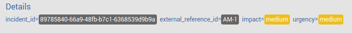

# Reference

## Introductions

### Technologies used by Alert Manager

As described above, the App writes different data and uses the Splunk framework components to provide comfortable end-user functionality.

* [App Key Value Store](http://dev.splunk.com/view/webframework-features/SP-CAAAEY7)
  * Save and track states of incidents
  * Store incident defaults and user settings
  * Store alert results per incident
* [Splunk REST API](http://dev.splunk.com/view/rest-api-overview/SP-CAAADP8)
  * Write events to the index
  * Add/retrieve data from the App Key Value Store
  * Manage App configuration
* [Splunk JS Stack](http://dev.splunk.com/view/webframework-splunkjsstack/SP-CAAAESV)
  * Extend Splunk dashboards with workflow functionality
  * Extend and enhance Splunk visualization components (Single value, Tables, ...)
  * Provide 3rd party visualizations

## Custom Search Commands

### loadincidentresults

**Usage**: ```<your search> | table _time incident_id | loadincidentresults incident_id```

**Parameters:**

* `incident_id`: ID of the incident per search result (Required)

Returns results of incidents from the KV store given a list of incidents having an `incident_id` field present.

### modifyincidents

**Usage**:

```<your search> | table _time incident_id | modifyincidents status=<new status> owner=<new owner> urgency=<new urgency> comment=<comment>```

**Parameters:**

* `status`: New status of the incident(s) (Optional)
* `status`: New owner of the incident(s) (Optional)
* `urgency`: New urgency of the incident(s) (Optional)
* `comment`: Text of the comment to add to the change event (Optional)

Updates incident attributes such as status, owner, urgency and adds a comment, if provided. Requires the field `incident_id` in the search results. Use any attribute in combination or by oneself.


## External Reference ID

The incident collection has an additional column `external_reference_id` which can be used to store references to other systems. Typically this field is updated by an external process. The value of the field will be displayed in the details section of an incident if it is set.



## Reports

tbd

## Datamodel

tbd

## Troubleshooting

tbd