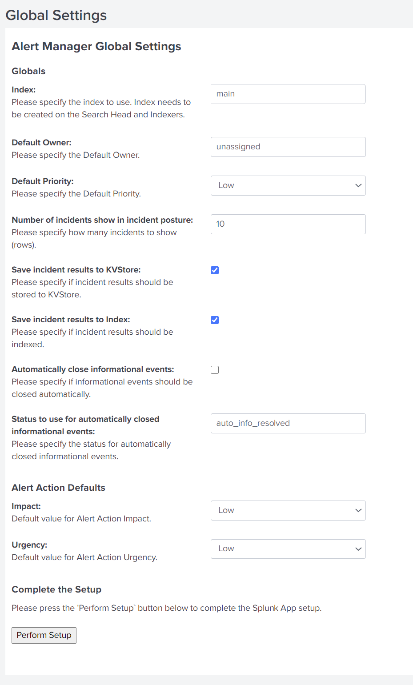

# Updating to Release 2.2.x

## Before you update

**Important:** This release has changes regarding how indexes are handled. Additionally, the way how users are enabled for Alert Manager changed. Read carefully!

### Note about Index
Previous releases were delivered with a default _indexes.conf_ file. Due to certification reasons this is not allowed anymore.

Before upgrading make sure you have a valid indexes.conf on both the search-head and the indexer pointing to your index that stores the alerts (e.g. _alerts_).

**Important**: Do not save indexes.conf to
```
$SPLUNK_HOME/etc/apps/alert_manager/default
```
or
```
$SPLUNK_HOME/etc/apps/TA-alert_manager/default
```
as these settings may be lost after an update.

### Note about Users
Prio to this release, users for Alert Manager were enabled to use a capability named *am_is_owner*. Meanwhile, the App Certification criteria has changed and prevents us from further shipping authorize.conf with modified capabilites. Therefore, we decided to change the way how users are enabled from capabilities to roles. From release 2.2.x and later, user need to have a role **alert_manager** or **alert_manager_user** assgined or inherited, so they will be enabled as a user to assign new incidents to.

## Update Procedure

Update the alert_manager on the search head, and TA-alert_manager addon on both the search-head and indexer (if needed).

## After the Update
### Configure User
Go to Settings --> Access controls --> Users and make sure to enable **alert_manager** or **alert_manager_user** role on all users to be enabled for Alert Manager.

### Configure Index
Configure the index where alerts are stored (e.g. _alerts_) in the Alert Manager's _Global Settings_ view:



Alternatively, you can also set the index name in local/alert_manager

```ini
[settings]
index = alerts
```

See the _Installation Manual_ for more details.
