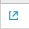
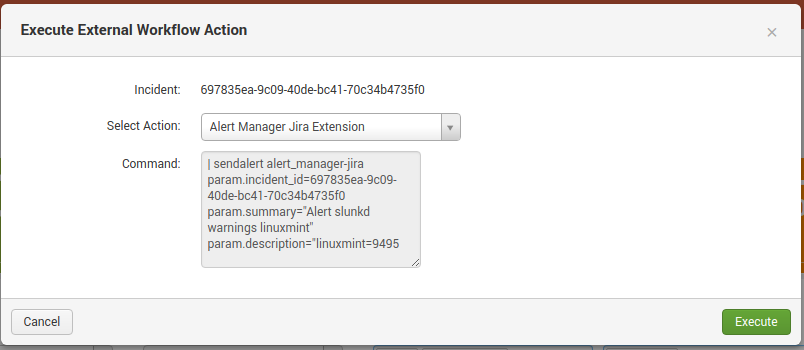

# User Manual

## Configure Supressions

Suppression Rules have different intentions:

* Support maintenance windows
* Maintain false-positives
* Report on incidents without moving them through the Incident workflow

At the time an Incident is getting created, the Alert Manager will check against matching Suppression Rules. If the suppression is successful, the Incident will be created with status *suppressed* and won't show up by default on the Incident Posture dashboard. Further, only the **incident_suppressed** event will be fired to handle Notifications.

### Add Suppression Rules

* Open Settings -> Suppression Rules in the Alert Manager
* Click *Add Suppression Rule* to add a new collection of Suppression Rules
* Add a title and a description
* Select a rule type. **Note:** The rule type doesn't have any effect to the functionality, it is only supposed for documentation.
* Specify the scope of this rule
  * The scope defines for which *saved searches* the Suppression Rules will compared against. You can use wildcards (`*`), one or many times, to specify a variable scope.
  * Example:
    * `alert_*` will match any alert name beginning with *alert_*
    * `foo_*_bar` will match *foo_test_bar* and *foo_hello_world_bar*
* Click *Save*
* Click on the name of the rule collection to switch to the Suppression Rule Editor
* Add a field name using the `$result.fieldname$`
  * Use `_time` to use the current timestamp (UNIX epoch timestamp)
* Select a condition
* Add a value which will be compared against the value from the field
  * If you selected `_time` as a field, make sure to compare against a valid UNIX epoch timestamp
* Add as many rules as you want
* Click *Save* to add the new rules at the bottom right corner

**Important:** All of the rules specified in a rule collection must be true in order to have a valid suppression.

### Verify Suppressions

Suppressed incidents can be reviewed in the Incident Posture dashboard

* Select a valid timerange and *Suppressed* as status filter option
* Expand the row of an incident by clicking the *>* icon in the *i* column.
* The incident history shows an entry containing the name of the suppression rule collection responsible for the suppression

### Auto Suppression

If you enabled *Auto-resolve incidents on adding new matching suppression rules* in the Custom Alert Action parameters on your alert, the Alert Manager scheduler will auto-resolve matching Incidents after the rule has been added. Incidents will be turned into the status *auto_suppressed_resolved*. If this option is disabled only new matching Incidents get suppressed.

## Use External Workflow Actions

* On the incident posture dashboard, click on the External Workflow Action button 
* The Execute External Workflow Action -windows will open

* Select the Action
* (Optional) Check the command to be executed
* Execute the action
* Alert Manager will update the history with the action

## Quick assign

* To assign an incident to the current user, press the quick assign button

